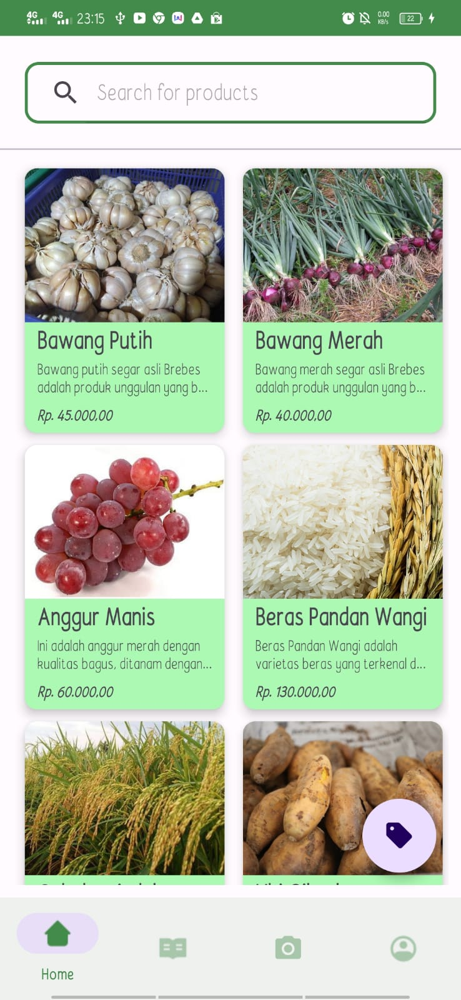

## Project TaniKami Android - Frontend - Mobile Development
This Project is android project of TaniKami mobile apps, we use material design 3 as components of this mobile app. This TaniKami project mobile app already integrated with Machine Learning model to detect disease of plants. The disease of plants that can be detected using this app still limited, and will be improved as time pass. We hope TaniKami can be used to solve real problem of all farmer that difficult to sell their pwn harvest to sell it in another area in Indonesia.

## UI and Overview of our app

## How to install?
Please refer to this [link](https://drive.google.com/file/d/1TF5WZMqernF3dTCGdTxFY91zBxFr8rFS/view?usp=sharing) and download .Apk file from that link, and install it in your phone. Don't forget to register and login after installation is successfull.

## Video Demo App
This is our demo video about TaniKami 
* [Video Demo] ()

## How To detect disease in plants?
To detect disease in plants, below is the guide step by step:
* [Video Demo](https://drive.google.com/file/d/1c9bS_UyCzQ1IZbjfeML23CpTuWUtWz7L/view?usp=sharing)

## List of disease that can ve detected by this app :
List of plants disease that can be detected in this [link](https://github.com/C23-PS237/TaniKami-Machine-Learning-MobileNet/blob/main/ThirthyEightPlusRice.txt) - Contributed by Machine Learning students

## Contributed by - Mobile Development student : 
* [FREDY AKTOSA](https://www.linkedin.com/in/aktofredy/) - Mobile Development Student - `A139DSX1024`
* [Jessica Amadea Rahma](https://www.linkedin.com/in/jessica-amadea-rahma-244040221/) - Mobile Development Student - `A139DSY1141`
